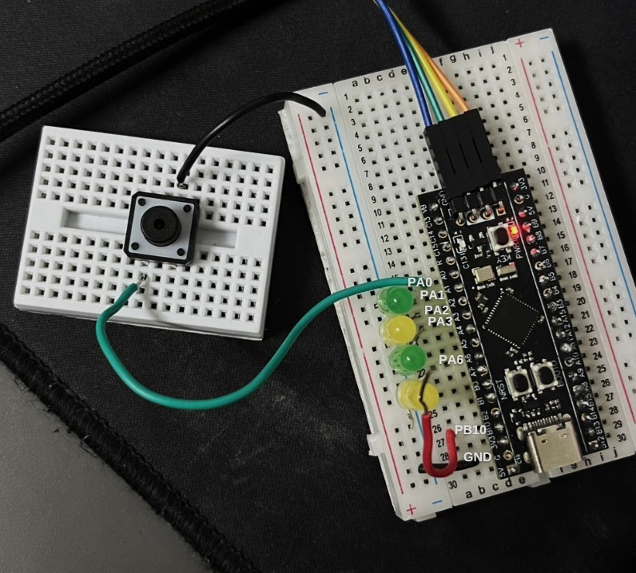

# ENE331 Lab 1 -STM32 Register-level Programming

## Description
This project is created for **ENE331 Laboratory Challenge**. It is focused on low-level programming with STM32 microcontroller (using direct register access only). The implementation avoids the use of HAL libraries to gain hands-on experience with STM32's peripheral registers.

## Problem Statement

1. **Clock Configuration**
   - System clock must be set to 72 MHz
   - External Crystal Oscillator: 25 MHz

2. **LED Blinking**
   - LED connected to pin `PA6` must blink every **1.2 ms**

3. **User Input with LUT Control**
   - When the user presses the button at `PA0`, the LED array at `PA1`, `PA2`, and `PA3` must light up according to a **Lookup Table (LUT)**
   - After finishing all states, the sequence must loop back to state 0

4. **Timer Configuration**
   - Use **Timer2** to generate a timing signal of **20 µs**
   - Timer2 output should be sent to pin `PB10`

5. **Independent Operation**
   - Each function must operate **independently** from one another

## Objectives

- Timer output observed on PB10 using oscilloscope
- LED at PA6 blinks every 1.2 ms
- LUT operates correctly with button on PA0

## Requirements

- All GPIO Read/Write operations must be done using **direct Register configuration only**
- Show calculation method for timer configuration
- Timer output must be measured using an **oscilloscope**

