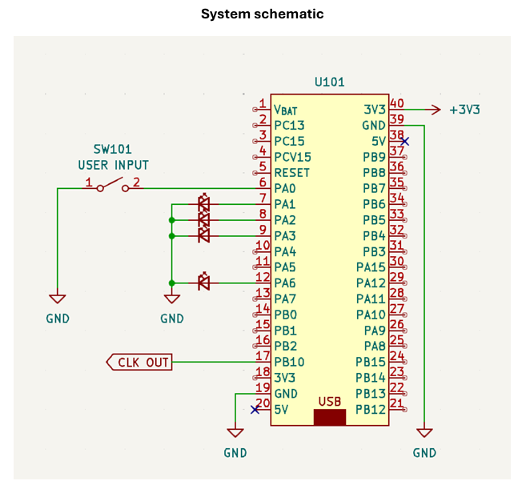
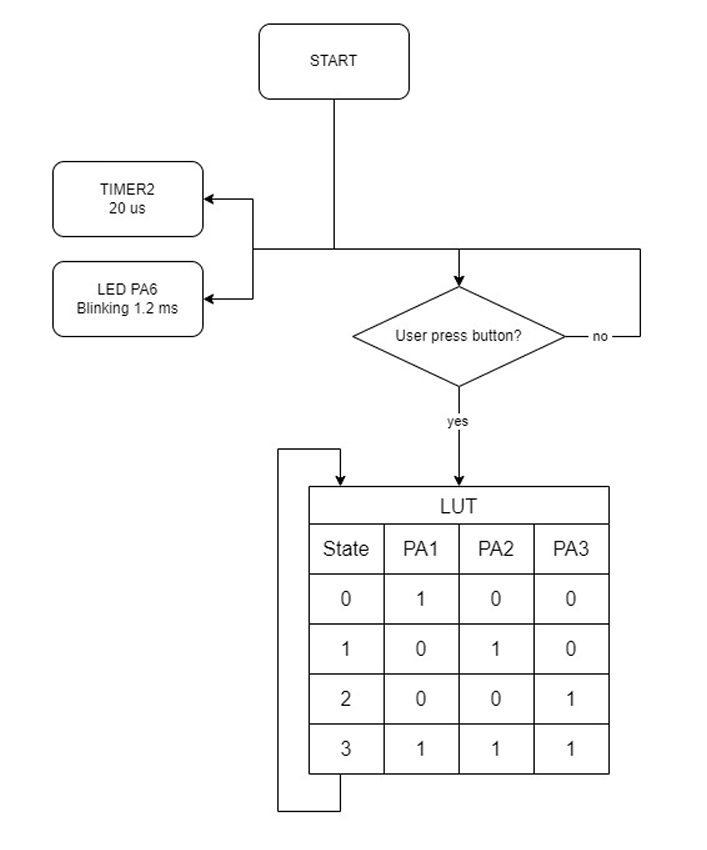

# ENE331 Lab 1 -STM32 Register-level Programming

## Description
This project is created for **ENE331 Laboratory Challenge**. It is focused on low-level programming with STM32 microcontroller (using direct register access only). The implementation avoids the use of HAL libraries to gain hands-on experience with STM32's peripheral registers.

## Objectives

- Timer output observed on PB10 using oscilloscope
- LED at PA6 blinks every 1.2 ms
- LUT operates correctly with button on PA0

## Requirements

- All GPIO Read/Write operations must be done using **direct Register configuration only**
- Show calculation method for timer configuration
- Timer output must be measured using an **oscilloscope**

### System Schematic

The following schematic was provided in the lab handout. It shows how the STM32 is connected to external components like the LED array, button, and Timer2 output.

### Block Diagram

## Results

### STM32 Circuit setup

